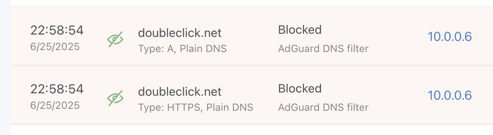

# VPN Ad Blocker

A self-hosted WireGuard VPN combined with AdGuard Home for ad-blocking on all connected devices.

```
       +-------------+
       |  Internet   |
       +------+------+ 
              |
       Public IP (VPS)
              |
         +----v----+
         |   VPS   |
         | Ubuntu  |
         +----+----+
              |
   +----------+-----------+
   | WireGuard VPN Server |
   |  AdGuard Home DNS    |
   +----------+-----------+
              |
      +-------+-------+
      |               |
  +---v---+       +---v---+
  | Client|       | Client|
  |Device |       |Device |
  |(Laptop|       |(Phone)|
  | or    |       | or    |
  |Phone) |       |Laptop)|
  +-------+       +-------+
(VPN Tunnel)     (VPN Tunnel)
```

## Progress Summary
- Provisioned Hetzner VPS (CX21) with Ubuntu 24.04
- Installed & configured WireGuard VPN for secure client access
- Installed & configured AdGuard Home for DNS-level ad blocking
- Configured UFW to secure server and allow necessary traffic
- Created scripts to automate setup & client config generation (including QR codes)
- Hardened server security by disabling password login & rotating SSH keys
- Verified VPN & ad-block functionality on multiple devices


## Scripts
This repo includes helper scripts to speed up provisioning and client setup.

### `setup.sh`

Installs and configures WireGuard and AdGuard Home.  
Run this on your VPS:

```bash
curl -O https://raw.githubusercontent.com/navillasa/vpn-ad-blocker/main/setup.sh
chmod +x setup.sh
sudo ./setup.sh
```

### `add-client.sh`

Generates a new WireGuard config for an additional client device (e.g. laptop or phone).

If `qrencode` is installed, it also prints a QR code to scan from the WireGuard mobile app.

```bash
curl -O https://raw.githubusercontent.com/navillasa/vpn-ad-blocker/main/add-client.sh
chmod +x add-client.sh
sudo ./add-client.sh phone -q
```
The config will be saved in ./clients/clientname.conf. You can either:

- Import the config file directly into the WireGuard desktop app, *or*
- Scan the QR code (if you used -q) directly into the WireGuard mobile app:

  1.  Open the WireGuard app
  2.  Tap +
  3.  Choose Scan from QR code

Check out the AdGuard dashboard at `http://your_vps_ip:3000` then go to the queries tab to see logs of what's getting blocked 😳


## Helpful Commands for Debugging
```
# Check service status
sudo systemctl status adguardhome
sudo systemctl status wg-quick@wg0

# Check out logs with filters
sudo journalctl -u adguardhome -f
sudo journalctl -u wg-quick@wg0 -f

# Check WireGuard peers
sudo wg show

# Verify firewall rules
sudo ufw status verbose
```

## Takeaways
- Refreshed knowledge of Linux server security, firewall configuration, and SSH hardening
- Practiced setting up secure VPN access with WireGuard
- Learned to manage DNS-level ad blocking using AdGuard Home
- Practiced troubleshooting networking and port conflicts
